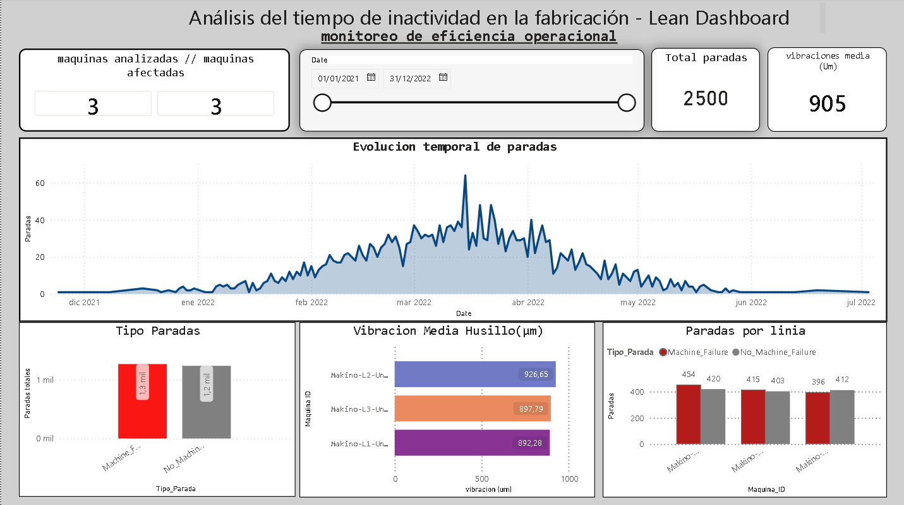
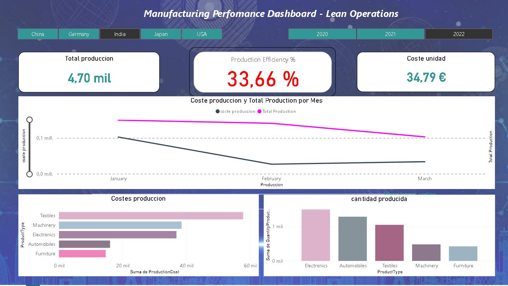
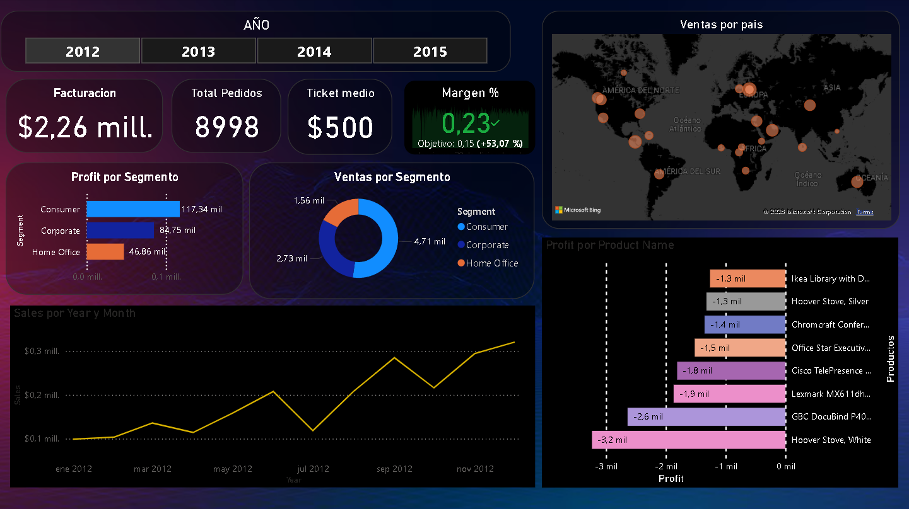

Power BI Portfolio — Business Intelligence & Lean Analytics
Descripción:

Este repositorio contiene una colección de proyectos desarrollados en Power BI enfocados en análisis de negocio y operaciones Lean.

Cada proyecto simula escenarios reales de empresa e industria con el objetivo de aplicar análisis de datos orientado a la toma de decisiones.

Proyectos incluidos

1. Manufacturing Performance — Lean Operations

Análisis de eficiencia productiva, costes operativos y KPIs industriales.

Carpeta: /Manufacturing-Performance

2 .Machine Downtime — Lean Manufacturing

Análisis de paradas de máquina, disponibilidad y causas de ineficiencia.

Carpeta: /Machine-Downtime

3. Business Performance Dashboard

Análisis ejecutivo de ingresos, beneficios y márgenes.

Carpeta: /Business-Performance

Herramientas utilizadas

Power BI Desktop

DAX

Modelado de datos

Diseño de KPIs

Autor

Jaume

mas informacion : www.jaumerrm.dev